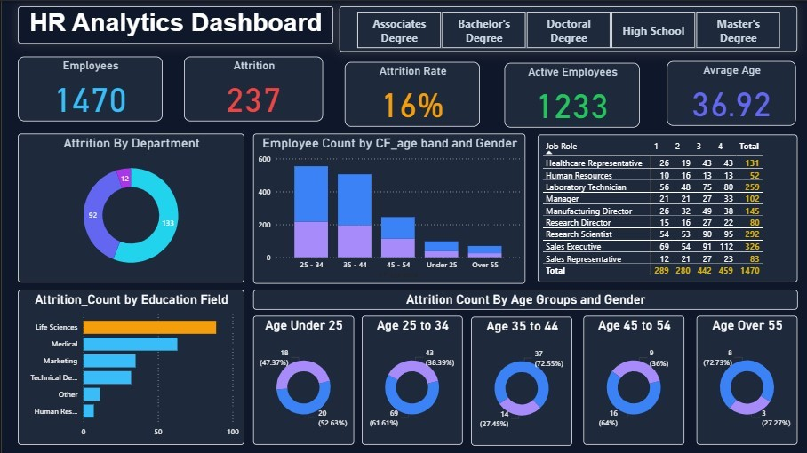

# HR Analytics Dashboard (Power BI)

## 📊 Project Overview
Developed an interactive HR Analytics Dashboard using Power BI to analyze employee attrition, demographics, and department performance.

## 📌 Key Metrics
- Total Employees: 1470
- Attrition Count: 237
- Attrition Rate: 16%
- Active Employees: 1233
- Average Age: 36.92

## 🔍 Key Insights
- Highest attrition observed in 25–34 age group
- Sales department shows higher employee turnover
- Majority employees hold Bachelor's degree
- Gender-wise distribution analyzed across age bands

## 🛠 Tools & Skills Used
- Power BI
- DAX Measures
- Data Modeling
- Data Cleaning
- KPI Cards
- Interactive Filters & Slicers

## 📷 Dashboard Preview

## 🚀 How to Use
1. Download the .pbix file
2. Open in Power BI Desktop
3. Explore interactive visuals
